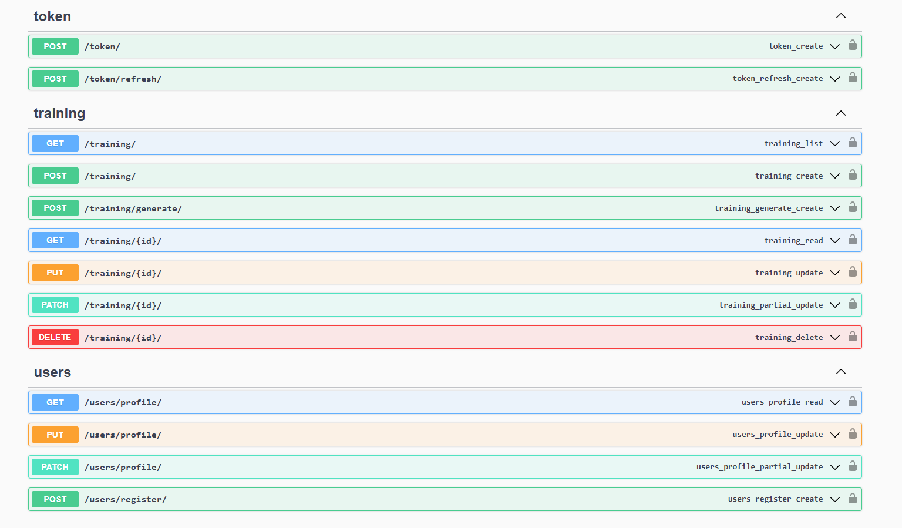

# Fitness API

Una API REST desarrollada con Django Rest Framework para gestionar planes de entrenamiento personalizados y perfiles de usuario.

## 🚀 Características

- Autenticación mediante JWT (JSON Web Tokens)
- Generación automática de planes de entrenamiento usando OpenAI
- Gestión de perfiles de usuario con preferencias de entrenamiento
- Documentación interactiva con Swagger/OpenAPI
- Tests automatizados para todos los componentes
- Internacionalización (i18n) configurada para español

## 🛠️ Tecnologías Utilizadas

- Python 3.x
- Django 5.1
- Django Rest Framework
- Simple JWT
- OpenAI API
- SQLite3
- Swagger/OpenAPI (drf-yasg)
- pytest

## 📌 Prerrequisitos

- Python 3.x
- pip (gestor de paquetes de Python)
- Cuenta en OpenAI (para la generación de planes)

## 📥 Instalación

### 1. Clona el repositorio:

```bash
git clone https://github.com/tu-usuario/fitness-api.git
cd fitness-api
```

### 2. Crea y activa un entorno virtual:

```bash
python -m venv venv
source venv/bin/activate  # Linux/Mac
venv\Scripts\activate  # Windows
```

### 3. Instala las dependencias:

```bash
pip install -r requirements.txt
```

### 4. Crea un archivo `.env` en la raíz del proyecto:

```plaintext
SECRET_KEY=tu_secret_key
OPENAI_API_KEY=tu_api_key_de_openai
```

### 5. Ejecuta las migraciones:

```bash
python manage.py migrate
```

### 6. Crea un superusuario:

```bash
python manage.py createsuperuser
```

### 7. Inicia el servidor:

```bash
python manage.py runserver
```

## 📂 Estructura del Proyecto

```plaintext
fitness_api/
├── apps/
│   ├── training/
│   │   ├── api/
│   │   ├── services/
│   │   ├── tests/
│   ├── users/
│   │   ├── api/
│   │   ├── tests/
├── .env.example
├── fitness_backend/
├── manage.py
├── requirements.txt
```

## 📚 Documentación API

La documentación completa de la API está disponible en:

- Swagger UI: `/swagger/`
- ReDoc: `/redoc/`



### Endpoints Disponibles

#### 🔐 Autenticación (token)
- `POST /token/` - Obtener token JWT
- `POST /token/refresh/` - Refrescar token JWT

#### 🏋️ Entrenamiento (training)
- `GET /training/` - Listar planes de entrenamiento
- `POST /training/` - Crear nuevo plan
- `POST /training/generate/` - Generar plan automático
- `GET /training/{id}/` - Obtener plan específico
- `PUT /training/{id}/` - Actualizar plan completo
- `PATCH /training/{id}/` - Actualizar plan parcialmente
- `DELETE /training/{id}/` - Eliminar plan

#### 👤 Usuarios (users)
- `GET /users/profile/` - Obtener perfil de usuario
- `PUT /users/profile/` - Actualizar perfil completo
- `PATCH /users/profile/` - Actualizar perfil parcialmente
- `POST /users/register/` - Registrar nuevo usuario

## ⚙️ Configuración

El proyecto utiliza variables de entorno para la configuración. Principales variables:

```plaintext
SECRET_KEY: Clave secreta de Django
OPENAI_API_KEY: API key de OpenAI
DEBUG: Modo debug (True/False)
```

## 🧪 Tests

El proyecto incluye tests exhaustivos para todos los componentes. Para ejecutarlos:

```bash
pytest
```

O para un directorio específico:

```bash
pytest apps/training/tests/
pytest apps/users/tests/

```